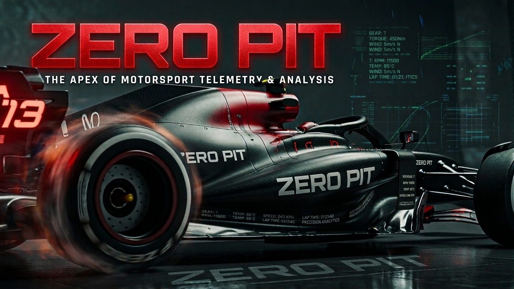
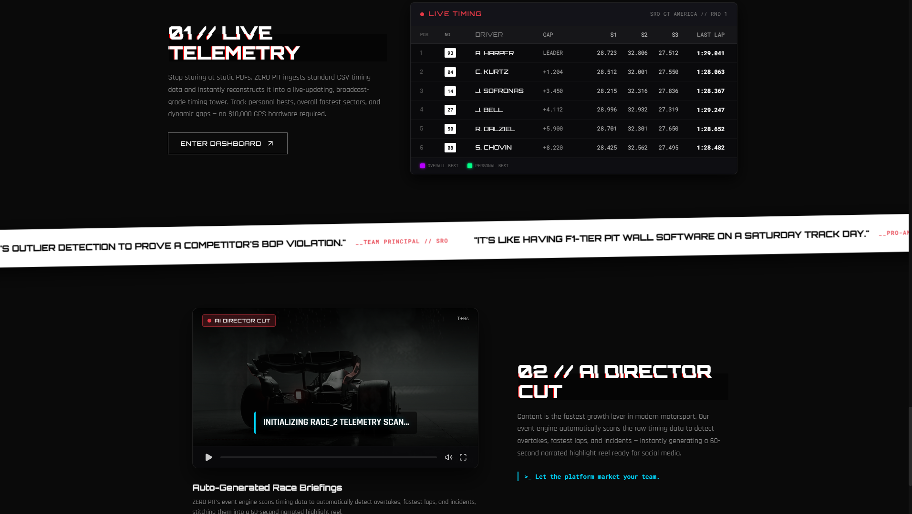
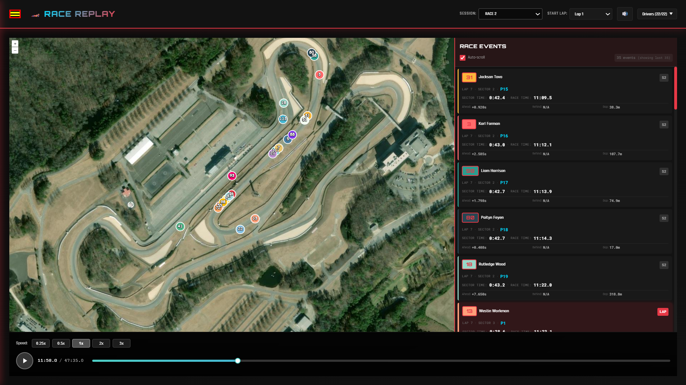
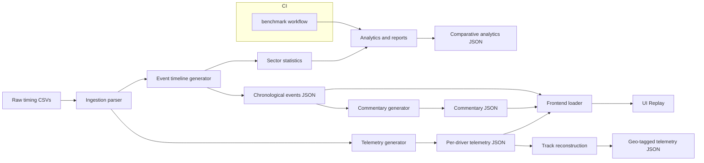
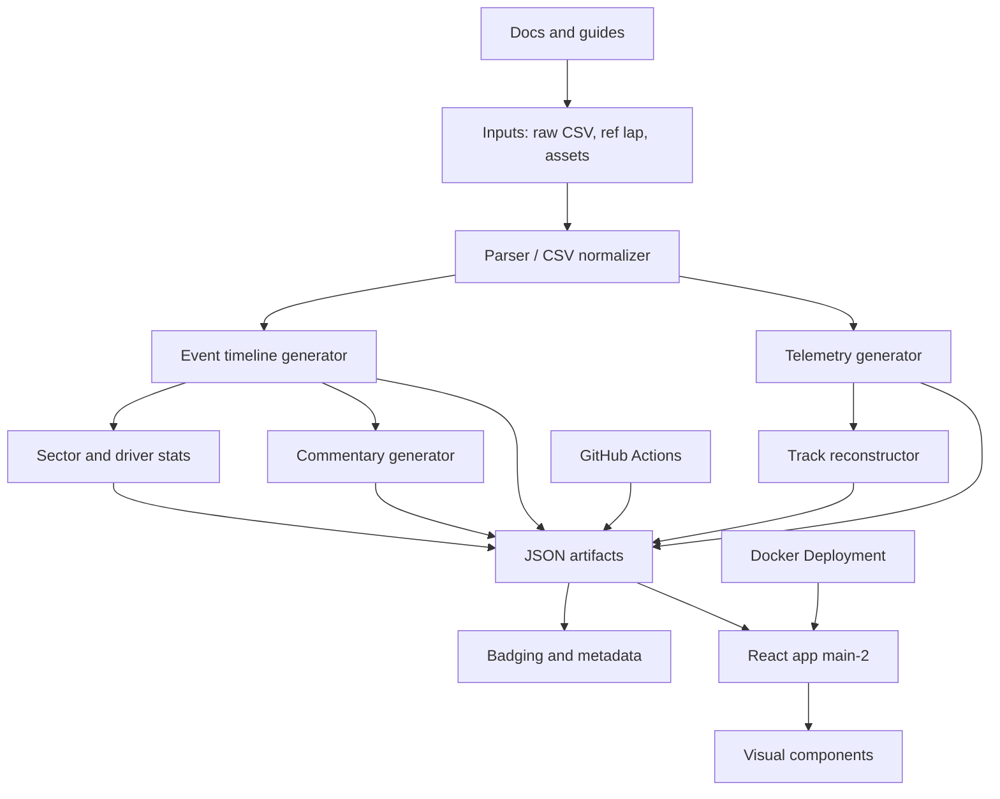

# ZERO PIT - Motorsport Timing to Replayable Insights

ZERO PIT converts raw race timing sheets into **deterministic JSON artifacts**, **replayable telemetry**, and **AI-ready commentary events** consumed by a modern **React** dashboard.

[](LICENSE) [](https://www.python.org/) [](https://zero-pit.xyz/)

---

## Demo

[](https://drive.google.com/file/d/1CzMuxB8zl_3LwmXLUH5KJ1F9yBbBnItx/view?usp=sharing)

---

## Screenshots

### Landing Page



### Race Replay Page



---

## Overview

- ZERO PIT exists to turn raw timing sheets into something a person can actually watch, compare, and explain. It bridges the gap between race-control data and a polished product experience: synthetic telemetry, race replay, AI-style commentary, and analysis views that make the weekend readable in seconds instead of spreadsheets.
- The difference is the combination of **offline Python processing** and a **React dashboard**: the pipeline creates stable JSON artifacts, while the frontend turns them into live replay, radar comparisons, insight panels, and race stories that are easy to demo.
- **Design principle:** **JSON-first** so heavy processing stays deterministic, the UI stays fast, and the benchmark claims remain reproducible.

---

## Problem

- Race timing data is rich, but it is usually trapped in tables, CSV exports, and disconnected analysis tools. That makes it hard for teams to answer basic questions quickly: who was fastest, where did the fight happen, who gained momentum, and what changed across the weekend?
- For demos and recruiting, the bigger problem is visibility. A repo that only shows Python scripts looks like a data utility, not a full product. Without a front-end story, the replay experience, radar charts, compare modes, and commentary features remain hidden.

---

## Solution

- **Deterministic pipeline:** `timing-generator` ingests timing CSVs, synthesizes telemetry via time-warping, generates chronological event timelines, detects commentary events, and writes per-driver + complete JSON outputs consumed by `main-2`.
- **React dashboard:** `main-2` turns those artifacts into Race Replay, radar comparisons, Race Compare modes, Weekend Insights, and commentary-driven storytelling that makes the data feel like a product instead of a script collection.
- **Included:** `benchmark_claims.py` reproduces held-out baselines and commentary latency measurements so the headline claims stay auditable.

---

## Key Features

| Feature | What it does |
|---|---|
| **Telemetry generation** | Generate per-driver **GPS traces** and per-lap telemetry from timing + reference laps |
| **Chronological timeline** | Produce ordered **sector-completion** events with positions, deltas, gaps |
| **Commentary events** | Detect **overtakes**, **battles**, **PBs**, race/podium/leader changes |
| **Reproducible benchmark** | `benchmark_claims.py` outputs `timing-generator/output/claim_benchmark_report.json` with **model** vs **baseline** numbers |
| **Per-driver JSON outputs** | `event_timeline_driver_*.json`, `driver_*.json` for selective replay and analytics |
| **Alpha Score** | Ranks every driver against the full field using **z-score normalization** across lap time, consistency, and sector performance |
| **Race Replay** | Animates all cars simultaneously on a satellite map using **OpenLayers**, interpolated at **60fps** from synthetic telemetry |
| **Radar Comparison** | Compares up to **6 drivers** across **7 normalized dimensions** on a single interactive spider chart |
| **Race Compare** | Four analysis modes: **performance gaps**, **battle dynamics**, **race flow narrative**, and **consistency distribution** |
| **Configurable delta mode** | Switches between **gap-to-leader** and **gap-to-car-ahead** via config, no code change needed |
| **Lap-by-Lap Leaders** | Recalculates full field rankings at any chosen lap within a race session |
| **Cross-Race Analytics** | Identifies **most improved drivers**, **traffic penalties**, and **position change efficiency** across events |
| **AI Commentary** | Generates commentary-ready events for overtakes, personal bests, race-best sectors, podium changes, and close battles |
| **Weekend Storylines** | Surfaces trends, momentum shifts, and competitive health across the full event weekend |

---

## Architecture (flow)



## Architecture (component graph)



---

## Component references (short)

- `timing-generator/event_timeline_generator.py` - **core chronological engine**: converts timing rows to sector completion events, computes positions, deltas, and performance buckets.
- `timing-generator/race_commentary_generator.py` - **commentary generator**: consumes timeline JSON and emits commentary events (overtakes, podium swaps, PBs, battles).
- `timing-generator/benchmark_claims.py` - **benchmark runner**: writes `timing-generator/output/claim_benchmark_report.json` (position persistence vs majority baseline; commentary latency).
- `track_reconstruct/track_reconstruction.py` - **track reconstructor**: dead-reckoning reconstructor that backfills lat/lng and distances using a bicycle kinematic model and loop-closure.
- `main-2/` - **React visualization**: replay, race timeline, commentary popup, insight panels; `package.json` lists ECharts, Three.js, OpenLayers, GSAP, and Recharts.

---

## Benchmark (reproducible claim)

- **Source file:** `timing-generator/benchmark_claims.py` (uses `timing-generator/output/race_2/event_timeline_complete.json` by default).
- **Report:** `timing-generator/output/claim_benchmark_report.json` (included in repo). Example values:
  - **`position_benchmark.model_accuracy`**: **0.8896103896103896**
  - **`position_benchmark.majority_baseline_accuracy`**: **0.045454545454545456**
  - **`commentary_benchmark.seconds`**: **0.10521860000062588**

Run locally (from repo root):

```bash
python -m pip install --upgrade pip
pip install pandas numpy
python timing-generator/benchmark_claims.py
```

---

## Tech stack
<p align="center">
  <a href="https://www.typescriptlang.org/" target="_blank" rel="noreferrer"></a>
  <a href="https://react.dev/" target="_blank" rel="noreferrer"></a>
  <a href="https://www.python.org/" target="_blank" rel="noreferrer"></a>
  <a href="https://vitejs.dev/" target="_blank" rel="noreferrer"></a>
  <a href="https://nodejs.org/" target="_blank" rel="noreferrer"></a>
  <a href="https://www.docker.com/" target="_blank" rel="noreferrer"></a>
  <a href="https://eslint.org/" target="_blank" rel="noreferrer"></a>
  <a href="https://github.com/features/actions" target="_blank" rel="noreferrer"></a>
  <a href="https://vercel.com/" target="_blank" rel="noreferrer"></a>
  <a href="https://threejs.org/" target="_blank" rel="noreferrer"></a>
</p>

<p align="center">
  <a href="https://greensock.com/gsap/" target="_blank" rel="noreferrer"></a>
  <a href="https://openlayers.org/" target="_blank" rel="noreferrer"></a>
  <a href="https://echarts.apache.org/" target="_blank" rel="noreferrer"></a>
  <a href="https://numpy.org/" target="_blank" rel="noreferrer"></a>
  <a href="https://scipy.org/" target="_blank" rel="noreferrer"></a>
  <a href="https://pandas.pydata.org/" target="_blank" rel="noreferrer"></a>
  <a href="https://pyyaml.org/" target="_blank" rel="noreferrer"></a>
</p>

---

## Project layout (short)

```
zero-pit/
├─ main-2/               # React UI (dev: npm run dev)
├─ timing-generator/     # Python pipeline: telemetry, timeline, commentary
│  ├─ input/
│  ├─ output/            # Generated JSON artifacts (event_timeline_complete.json)
│  ├─ event_timeline_generator.py
│  ├─ race_commentary_generator.py
│  └─ benchmark_claims.py
├─ track_reconstruct/
├─ main/                 # analysis helpers
├─ .github/workflows/    # CI (benchmark workflow)
└─ README.md
```

---

## Quick start (developer)

1. Install Python deps and run the pipeline (example):

```bash
cd timing-generator
python -m pip install -r requirements.txt  # or: pip install pandas numpy scipy
python generate_all.py
```

2. Run frontend dev server:

```bash
cd main-2
npm install
npm run dev
```

3. Reproduce benchmark (audit):

```bash
python timing-generator/benchmark_claims.py
cat timing-generator/output/claim_benchmark_report.json
```

---

## Deployment notes

- The pipeline can be dockerized (example Dockerfile in repo root suggestion). The frontend is deployable to Vercel directly from `main-2` (see `vercel.json`).
- CI: the `benchmark.yml` workflow runs the benchmark and uploads `claim_benchmark_report.json` as an artifact for audit.

---

## License

MIT: See [LICENSE](LICENSE) for details.

---

Built by [Daksh Goel](https://github.com/daksh777f)

